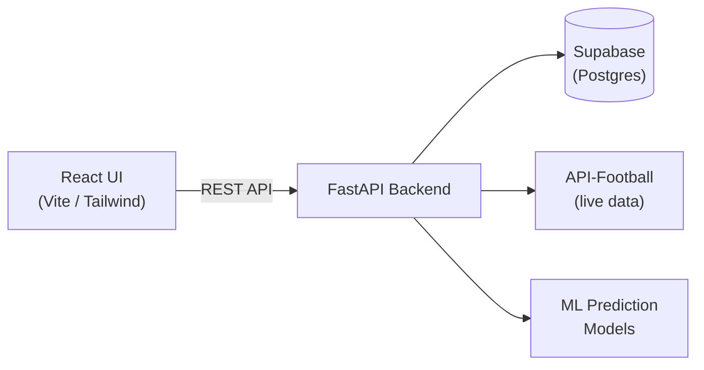

# ⚽ KickStats Analyzer

A full-stack football analytics platform delivering real-time team, player, and fixture data across global leagues — with a machine learning engine that predicts match outcomes and scorelines.


<!-- 📸 Add a screenshot or GIF of the dashboard here — this is the first thing recruiters look at -->
<!--  -->

---

## Overview

KickStats Analyzer is a full-stack web application that aggregates live football data — teams, players, leagues, and fixtures — through the API-Football (API-Sports) service, and layers a machine learning prediction engine on top to forecast match outcomes with confidence probabilities.

Built as an end-to-end project covering frontend, backend, database, ML modeling, and cloud deployment.

## Features

- **Team Explorer** — browse teams by country and league, view detailed team profiles and rosters
- **Live Fixtures** — real-time match schedules with scores, status, and kickoff times
- **Player Search** — look up any player's stats, nationality, age, and current team via live API data
- **Match Prediction Engine** — ML-powered outcome prediction (win/draw/loss), expected scoreline, and win probability breakdown
- **Graceful error handling** — clear fallback messages for missing API keys or empty result sets

## Tech Stack

| Layer | Technology |
|---|---|
| Frontend | React (Vite), Tailwind CSS, ShadCN UI |
| Backend | FastAPI (Python) |
| Database | Supabase |
| ML | Classification + regression models for outcome/scoreline prediction |
| External API | API-Football (API-Sports) |
| Deployment | AWS (backend), Vercel/Render (frontend) |
| Tooling | Postman, GitHub Actions |

## Architecture



## Getting Started

### Prerequisites
- Node.js 18+
- Python 3.10+
- An API-Football (API-Sports) key
- A Supabase project

### Setup

```bash
# Clone the repo
git clone https://github.com/thejeesh007/<repo-name>.git
cd <repo-name>

# Backend
cd backend
pip install -r requirements.txt
cp .env.example .env   # add your API-Football key and Supabase credentials
uvicorn main:app --reload

# Frontend
cd ../frontend
npm install
cp .env.example .env   # add backend URL
npm run dev
```

### Environment Variables

| Variable | Description |
|---|---|
| `API_FOOTBALL_KEY` | Your API-Football (API-Sports) key |
| `SUPABASE_URL` | Supabase project URL |
| `SUPABASE_KEY` | Supabase service/anon key |
| `VITE_BACKEND_URL` | Backend base URL for the frontend to call |

## Usage

**1. Explore Teams**
Navigate to the Teams page → select a country → select a league → click a team card to view players and stats.

**2. Check Fixtures**
Go to Matches → select country and league → view live and upcoming fixtures with teams, kickoff time, and current score/status.

**3. Search Players**
Open Players → search by name (e.g., "Messi") → view live stats: age, nationality, team, and performance data.

**4. Predict Match Outcomes**
Go to Prediction → select home and away teams → click Predict → view predicted result (win/draw/loss), expected scoreline, win probabilities, and an AI-generated analysis summary.

### Error Handling
- Missing/invalid API key → *"API Key not configured. Please check your .env file."*
- No data found → *"No records found. Try a different search or league."*

### Stopping the app
`Ctrl + C` in both the backend and frontend terminals.

## Roadmap
- [ ] Head-to-head historical comparison view
- [ ] League table / standings page
- [ ] Model accuracy dashboard (backtested predictions vs. actual results)

## Author
**Thejeesh G** — [LinkedIn](https://www.linkedin.com/in/thejeeshg/) · [GitHub](https://github.com/thejeesh007)

## License
MIT
